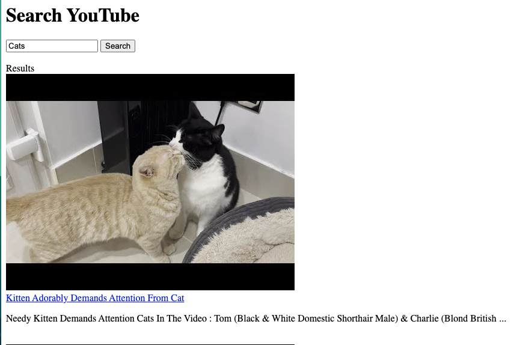
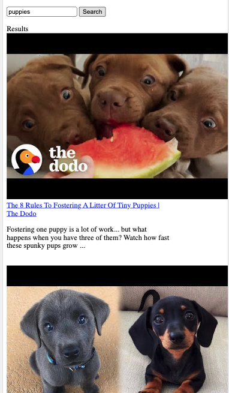

# APIYouTube

A coding tutorial created to review and practice JavaScript and pull from Google Cloud's YouTube API to create a search engine for YouTube results. Completed through Mammoth Interactive at [link to Mammoth Interactive Homepage](https://training.mammothinteractive.com/courses).

## Tech Used
- HTML
- JavaScript
- Google Cloud APIs

## Dependencies
None. Viewer only needs to utilize Live Server through the index.html file.

## Uses
Add user functionality with JavaScript to an HTML. Accesed Google Cloud API library and refreshed my understanding of the innerHTML element.

## How I veered from the original project
- the look of the landing page and order of resultsDiv

## Future Tasks
- polish app with more styling
- remove previous found results when user enters a new result
## History
After completing a Software Engineering certification program and during my job search, I needed to continue to pracitce my skill set in order to maintain it and learn more. I thought that even the most basic projects using the most basic languages was a great place to start.

## Desktop

## Mobile

